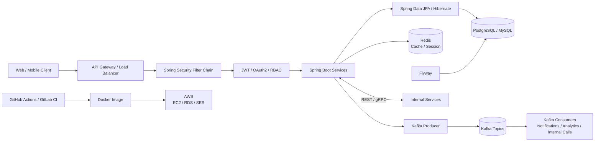

  

<table>
<tr>
<td width="68%" valign="top">

## Professional summary

Java Backend Developer focused on **Spring Boot, microservices, secure REST APIs, event-driven workflows and cloud-ready backend systems**.

I work mainly with **Spring Security, PostgreSQL, Apache Kafka, Redis, Docker, AWS and CI/CD**. The work I enjoy most is where backend correctness matters: role boundaries, state transitions, persistence, async workflows, auditability and release confidence.

[**BrainServe live demo →**](https://brain-serve-connect-vercel-demo.vercel.app/) · [**Browse repositories →**](https://github.com/JetyChodipilli?tab=repositories)

</td>
<td width="32%" align="center" valign="top">

<b>Backend first. Secure flows. Real systems.</b>

</td>
</tr>
</table>

---

## Backend tech stack

| Area | Technologies |
|---|---|
| **Languages** | Java 8 / 17 / 21, Python |
| **Frameworks** | Spring Boot, Spring MVC, Spring Security, Spring Cloud, Spring Data JPA, Hibernate ORM, WebFlux |
| **APIs & System Design** | RESTful APIs, Microservices, Event-Driven Architecture, gRPC, Protocol Buffers, API Gateway, Eureka, SOAP |
| **Databases** | PostgreSQL, MySQL, MongoDB, Hibernate / JPA |
| **Messaging** | Apache Kafka — producers, consumers, topics, event-driven patterns |
| **Cloud & DevOps** | AWS EC2, RDS, SES, Docker, GitHub Actions, GitLab CI, Git |
| **Security** | Spring Security, OAuth 2.0, JWT, RBAC, BCrypt, secure coding practices |
| **Testing** | JUnit 5, Mockito, unit and integration testing |
| **Tools** | IntelliJ IDEA, Postman, Eclipse / STS, MobaXterm, Maven |

  

---

## Selected engineering work

<table>
<tr>
<td width="66%" valign="top">

### 01 / BrainServe Connect  
**Enterprise Visitor & Workforce Management Platform**

A full-stack enterprise platform designed to digitize visitor management, employee operations, departmental workflows and internal communication.

The backend uses **seven-role RBAC** for System Admin, CEO, HR Admin, Team Lead, Employee, Receptionist and Security, with role-specific dashboards and approval flows.

**Visitor flow**

`Security intake → Reception verification → HR review → Team Lead / Employee / CEO approval → QR visitor pass → check-in / completion`

**Backend work**
- department-based employee onboarding
- Team Lead assignment and task worksheets
- employee progress tracking and HR insights
- account approval and password recovery
- profile management and termination approval
- audit trails and permanent operational logs
- Kafka-based internal calls and workflow notifications
- PostgreSQL persistence, Redis support and Flyway migrations
- Spring Security, BCrypt, RBAC and validated state transitions

**Stack:** Java 21 · Spring Boot 3 · Spring Security · Spring Data JPA · PostgreSQL · Kafka · Redis · Flyway · Maven · Docker · REST APIs

[**Open live demo →**](https://brain-serve-connect-vercel-demo.vercel.app/)  
[Demo repository →](https://github.com/JetyChodipilli/Brainserve-Connect-client-demo)

</td>
<td width="34%" valign="top">

### 02 / Healthcare Patient Management System

A five-service microservices system covering:

- Patient Service
- Billing Service
- Analytics Service
- Auth Service
- API Gateway

**Architecture choices**
- gRPC + Protocol Buffers for Patient ↔ Billing communication
- Kafka consumer groups for analytics events
- JWT authentication behind Spring Cloud Gateway
- Dockerized services and PostgreSQL
- service decomposition with independent communication boundaries

[Repository →](https://github.com/JetyChodipilli/Healthcare-Patient-Management-System-Microservice)

</td>
</tr>
</table>

---

## Java backend architecture approach

This is the backend pattern I use across the projects in my portfolio. It is not a Figma-style box diagram; it shows how requests, security, persistence, async messaging and deployment fit together.

### Request path

`Client → Gateway → Security Filter Chain → Authorization → Controller → Service → Repository → Database`

### Async path

`Service → Kafka Producer → Topic → Consumer → Notification / Analytics / Internal Workflow`

### Delivery path

`Commit → CI/CD → Maven Build & Tests → Docker Image → AWS`

---

## Architecture decisions I care about

### Security before business logic
Authentication and authorization belong at the edge of the backend flow. Controllers should receive an already authenticated actor and still enforce resource-level permissions.

### One source of truth
Transactional state stays in PostgreSQL/MySQL. Redis is for cache or session use, not the authoritative business record.

### Sync and async have different jobs
REST or gRPC handles request/response work. Kafka handles workflows where producers should not block on downstream processing.

### Migrations are code
Flyway keeps schema changes versioned with the application instead of treating the database as a manually maintained dependency.

### Tests are part of delivery
JUnit/Mockito checks and integration verification belong before packaging and deployment, not after production issues appear.

---

## Supporting backend work

- [**Client Onboarding Platform**](https://github.com/JetyChodipilli/Client-Onboarding) — multi-tenant Spring Boot modular monolith with RBAC, MFA, PostgreSQL, Flyway and a versioned workflow engine.
- [**Payment Processing Microservice**](https://github.com/JetyChodipilli/Payment-Processing-Microservice-with-Stripe-and-MySQL) — Stripe charge → Spring Boot → MySQL persistence.
- [**AWS SES Email Service**](https://github.com/JetyChodipilli/AWS-SES-EmailSend-SpringBoot) — email state persisted around AWS SES delivery.
- [**Spring Batch Processing**](https://github.com/JetyChodipilli/Spring-Batch-Processing) — CSV ingestion and chunk-oriented batch processing.
- [**API Gateway Realtime Project**](https://github.com/JetyChodipilli/API-Gateway-Realtime-Project) — API Gateway and service-routing work.
- [**Spring Cloud API Gateway**](https://github.com/JetyChodipilli/Spring-Cloud-ApiGateway) — Spring Cloud Gateway / Eureka exploration.

---

## Language profile

  

If the live GitHub language card is temporarily unavailable, the resume-level language focus is:

**Java — primary backend language**  
**Python — secondary language**

---

## Contribution trail

<picture>
  <source media="(prefers-color-scheme: dark)" srcset="https://raw.githubusercontent.com/JetyChodipilli/JetyChodipilli/output/github-contribution-grid-snake-dark.svg" />
  <source media="(prefers-color-scheme: light)" srcset="https://raw.githubusercontent.com/JetyChodipilli/JetyChodipilli/output/github-contribution-grid-snake.svg" />
  
</picture>

---

## Current friction

I keep unfinished work visible instead of writing around it.

- **BrainServe demo:** the deployed public version is a client demonstration, not the live production backend.
- **Client Onboarding:** the current public `main` branch is implemented through Phase 3.
- **Payment service:** the learning repo still has request-contract and production-hardening work to do.

---

## If you are reviewing my work

Start here:

1. [**BrainServe Connect live demo**](https://brain-serve-connect-vercel-demo.vercel.app/) — enterprise workflows and product flow.
2. [**Client Onboarding**](https://github.com/JetyChodipilli/Client-Onboarding) — backend architecture, workflow engine and testing depth.
3. [**Healthcare Patient Management System**](https://github.com/JetyChodipilli/Healthcare-Patient-Management-System-Microservice) — microservices, gRPC, Kafka and Spring Cloud.
4. [**AWS SES Email Service**](https://github.com/JetyChodipilli/AWS-SES-EmailSend-SpringBoot) — AWS integration and delivery-state persistence.

Java · Spring Boot · Microservices · Kafka · PostgreSQL · AWS · Security · Testing
