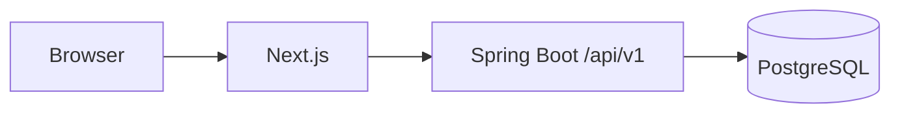

  

<table>
<tr>
<td width="68%" valign="top">

## What I actually work on

I build backend-heavy applications where **workflow, permissions, data integrity and failure handling** matter more than a pretty architecture diagram.

My default stack is Java + Spring Boot + PostgreSQL. I use Kafka, Redis and cloud services when the problem earns the extra moving parts.

Right now, most of my attention is on:
- multi-tenant application design
- workflow engines and state transitions
- authentication / authorization boundaries
- PostgreSQL-backed domain models
- integration testing and release confidence

[**BrainServe live demo →**](https://brain-serve-connect-vercel-demo.vercel.app/) · [**Browse repositories →**](https://github.com/JetyChodipilli?tab=repositories)

</td>
<td width="32%" align="center" valign="top">

<b>Backend first. Real trade-offs. Keep shipping.</b>

</td>
</tr>
</table>

---

## Proof, not slogans

<table>
<tr>
<td width="36%" valign="top">

### Client Onboarding
**Verified through Phase 3**

Spring Boot modular monolith, PostgreSQL, Flyway, Next.js, RBAC, MFA and a versioned workflow engine.

The reviewed Phase 3 branch passed backend, frontend, PostgreSQL/Chromium and container verification.

[Repository →](https://github.com/JetyChodipilli/Client-Onboarding)

</td>
<td width="32%" valign="top">

### BrainServe Connect
**Client demo with test evidence**

The public demo preserves the corrected production source while giving clients a password-free browser walkthrough.

**263** existing Node tests passed.  
**23** browser cases executed.

[Live demo →](https://brain-serve-connect-vercel-demo.vercel.app/)

</td>
<td width="32%" valign="top">

### Integration work
Small repos. One problem each.

Stripe payments.  
AWS SES email delivery.  
Spring Batch processing.  
File processing APIs.

[See the smaller builds →](#scraps--sandboxes)

</td>
</tr>
</table>

---

## Selected engineering work

<table>
<tr>
<td width="70%" valign="top">

### 01 / Client Onboarding Platform

**The flagship build.**

A multi-tenant B2B onboarding system built as a modular monolith. One Spring Boot deployable. One PostgreSQL source of truth. Explicit domain boundaries.

The workflow engine is the part I spent the most thought on.

A workflow template can change tomorrow; onboarding that already started should not mutate with it. Published workflow versions are immutable, and starting onboarding writes both an exact JSON snapshot and normalized step instances in one transaction.

Dependencies reject cycles and invalid edges. Conditions use a fixed model instead of executing tenant-authored code.

**On `main`:** identity, tenancy, RBAC, MFA, clients, contacts, services, projects and Phase 3 workflow execution.

`Java 17` · `Spring Boot 4.1` · `PostgreSQL 17` · `Flyway` · `Next.js 16` · `Testcontainers` · `Playwright`

[**Read the code →**](https://github.com/JetyChodipilli/Client-Onboarding)  
[Architecture notes →](https://github.com/JetyChodipilli/Client-Onboarding/tree/main/docs/architecture)

</td>
<td width="30%" valign="top">

### 02 / BrainServe Connect

The public repo is intentionally a browser demo.

Eight role workspaces, appointment flows, reports and recovery UI can be shown without exposing a real backend or giving clients production credentials.

The limitations are documented too: sample data, Chromium-only browser verification for the current pass, and a known large JS chunk warning.

[**Open live demo →**](https://brain-serve-connect-vercel-demo.vercel.app/)  
[Demo source →](https://github.com/JetyChodipilli/Brainserve-Connect-client-demo)

</td>
</tr>
</table>

---

## Architecture choices I care about

### Keep the system simple until complexity pays rent

For Client Onboarding, I chose a modular monolith instead of splitting the domain into services on day one.

That means:
- module boundaries are enforced in code before they become network boundaries
- transactions stay local while the domain is still evolving
- Redis and Kafka stay out until there is a measured reason to bring them in

Different project, different trade-off. BrainServe uses Kafka and Redis because its problem shape is different.

---

## Stack in rotation

  

**Daily tools:** Java · Spring Boot · PostgreSQL · Git · Maven  
**When the system needs them:** Kafka · Redis · Docker · AWS · GitHub Actions  
**Frontend enough to ship the whole flow:** Next.js · React · TypeScript

---

## Current friction

I keep this section because finished-looking portfolios are usually lying by omission.

**Client Onboarding**  
`main` currently stops at Phase 3. Client invitation and portal work are not merged there yet.

**BrainServe demo**  
The current build reports a large JavaScript chunk warning. Firefox, WebKit and real-device validation are still outside the last demo verification pass.

**Payment service**  
The learning repo still carries a misspelled `curreny` request field, inconsistent package naming and no idempotency layer. I documented it instead of polishing the README around it.

---

## Scraps & sandboxes

Not everything needs a case study.

| Repo | Why it exists |
|---|---|
| [BasicAuthentication](https://github.com/JetyChodipilli/BasicAuthentication) | Isolate Spring Security basics without a larger app around them |
| [CustomUserDetailsService](https://github.com/JetyChodipilli/CustomUserDetailsService) | Small authentication/user-details experiment |
| [API-Gateway-Realtime-Project](https://github.com/JetyChodipilli/API-Gateway-Realtime-Project) | Gateway/service-routing work |
| [Spring-Cloud-ApiGateway](https://github.com/JetyChodipilli/Spring-Cloud-ApiGateway) | Spring Cloud Gateway + Eureka exploration |
| [Payment Processing](https://github.com/JetyChodipilli/Payment-Processing-Microservice-with-Stripe-and-MySQL) | Stripe charge → MySQL persistence path |
| [AWS SES Email](https://github.com/JetyChodipilli/AWS-SES-EmailSend-SpringBoot) | QUEUED → SES → SENT/FAILED delivery state |
| [Spring Batch Processing](https://github.com/JetyChodipilli/Spring-Batch-Processing) | CSV ingestion and chunk processing |
| [File Processing API](https://github.com/JetyChodipilli/Spring-Boot-File-Processing-API) | CSV/Excel/XML processing experiments |

---

## Contribution trail

<picture>
  <source media="(prefers-color-scheme: dark)" srcset="https://raw.githubusercontent.com/JetyChodipilli/JetyChodipilli/output/github-contribution-grid-snake-dark.svg" />
  <source media="(prefers-color-scheme: light)" srcset="https://raw.githubusercontent.com/JetyChodipilli/JetyChodipilli/output/github-contribution-grid-snake.svg" />
  
</picture>

---

## If you are reviewing my work

Start here:

1. [**Client Onboarding**](https://github.com/JetyChodipilli/Client-Onboarding) — architecture and backend depth.
2. [**BrainServe Connect demo**](https://brain-serve-connect-vercel-demo.vercel.app/) — product flow and client presentation.
3. [**AWS SES Email Service**](https://github.com/JetyChodipilli/AWS-SES-EmailSend-SpringBoot) — small integration with explicit delivery states.
4. [**Payment Processing Service**](https://github.com/JetyChodipilli/Payment-Processing-Microservice-with-Stripe-and-MySQL) — useful partly because the rough edges are still visible.

Java backend engineering · system design · data integrity · testing · reliability
