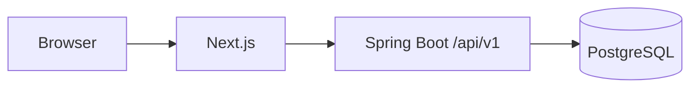

<table>
<tr>
<td width="64%" valign="top">

# Jety Chodipilli

### Java Backend Engineer

I build backend systems with **Java, Spring Boot, PostgreSQL, Kafka and Redis**.  
Most of my work is around workflow-heavy applications, API design, data consistency and the unglamorous parts that keep systems reliable.

  
  
  
  
  
  

**Build systems that are understandable, reliable and maintainable.**

[BrainServe live demo](https://brain-serve-connect-vercel-demo.vercel.app/) · [All repositories](https://github.com/JetyChodipilli?tab=repositories)

</td>
<td width="36%" align="center" valign="top">

<b>Backend first. Real systems. Keep building.</b>

</td>
</tr>
</table>

---

## Core expertise

<table>
<tr>
<td width="32%" valign="top">

**Backend**  
Java · Spring Boot · REST APIs · Spring Security

</td>
<td width="26%" valign="top">

**Data & messaging**  
PostgreSQL · MySQL · Redis · Kafka · Flyway

</td>
<td width="42%" valign="top">

**System work**  
Multi-tenancy · RBAC · workflow engines · event-driven flows · CI/CD · Docker

</td>
</tr>
</table>

---

## Selected engineering work

<table>
<tr>
<td width="68%" valign="top">

### Client Onboarding Platform — flagship

A multi-tenant B2B onboarding system built as a **Spring Boot modular monolith** with a Next.js frontend and PostgreSQL as the source of truth.

The part I care about most is the workflow engine: published workflow versions are immutable, onboarding starts from a snapshot, dependencies are validated, and tenant-authored conditions never execute arbitrary code.

**On `main` now:** identity, tenancy, RBAC, MFA, clients, contacts, services, projects and the Phase 3 workflow engine.

**Stack:** Java 17 · Spring Boot 4.1 · PostgreSQL 17 · Flyway · Next.js 16 · React 19 · Testcontainers · Playwright · Docker

[Repository](https://github.com/JetyChodipilli/Client-Onboarding)

</td>
<td width="32%" valign="top">

### BrainServe Connect

The public repo is a **browser demo**, not a fake production backend.

It lets a client move through eight role workspaces, sample appointment flows, reports and the connection-recovery experience without passwords or infrastructure.

**Demo evidence:** production tests stayed green; the demo browser suite covers desktop/mobile Chromium flows.

[Live demo](https://brain-serve-connect-vercel-demo.vercel.app/)  
[Demo repository](https://github.com/JetyChodipilli/Brainserve-Connect-client-demo)

</td>
</tr>
</table>

### Supporting work

- [**Payment Processing Microservice**](https://github.com/JetyChodipilli/Payment-Processing-Microservice-with-Stripe-and-MySQL) — Spring Boot → Stripe → MySQL payment flow.
- [**AWS SES Email Service**](https://github.com/JetyChodipilli/AWS-SES-EmailSend-SpringBoot) — persists email state around AWS SES delivery.
- [**Spring Batch Processing**](https://github.com/JetyChodipilli/Spring-Batch-Processing) — CSV ingestion and chunk-oriented processing.
- [**Spring Boot File Processing API**](https://github.com/JetyChodipilli/Spring-Boot-File-Processing-API) — file upload and conversion experiments.

---

## Architecture snapshot

This is the current Client Onboarding shape. I kept it as a modular monolith on purpose; Redis and Kafka are **not** in this project because the current workload does not justify them.

That project makes one trade-off very explicit: **keep module boundaries strong before paying the cost of distributed services.**

---

## Stack in rotation

  

---

## Current friction

I would rather show the rough edges than pretend everything is finished.

- **Client Onboarding:** `main` currently stops at Phase 3. Client invitation and portal work are not merged there yet.
- **BrainServe demo:** the build still reports a large JavaScript chunk warning. The browser verification is Chromium-based; Firefox, WebKit and real mobile devices are still outside the current demo test pass.

---

## Scraps & sandboxes

Small repos where I isolate one idea instead of dressing everything up as a flagship project.

- [BasicAuthentication](https://github.com/JetyChodipilli/BasicAuthentication)
- [CustomUserDetailsService](https://github.com/JetyChodipilli/CustomUserDetailsService)
- [API-Gateway-Realtime-Project](https://github.com/JetyChodipilli/API-Gateway-Realtime-Project)
- [Spring-Cloud-ApiGateway](https://github.com/JetyChodipilli/Spring-Cloud-ApiGateway)

---

## Contribution journey

<table>
<tr>
<td width="72%" valign="top">

<picture>
  <source media="(prefers-color-scheme: dark)" srcset="https://raw.githubusercontent.com/JetyChodipilli/JetyChodipilli/output/github-contribution-grid-snake-dark.svg" />
  <source media="(prefers-color-scheme: light)" srcset="https://raw.githubusercontent.com/JetyChodipilli/JetyChodipilli/output/github-contribution-grid-snake.svg" />
  
</picture>

</td>
<td width="28%" valign="top">

</td>
</tr>
</table>

---

## Live evidence

**BrainServe Connect client demo:**  
https://brain-serve-connect-vercel-demo.vercel.app/

The demo is intentionally sample-data driven. No live database, JWT sign-in, email, OTP, Kafka, Redis or backend export jobs are running behind that public walkthrough.

---

Java backend engineering · system design · data flows · testing · reliability
