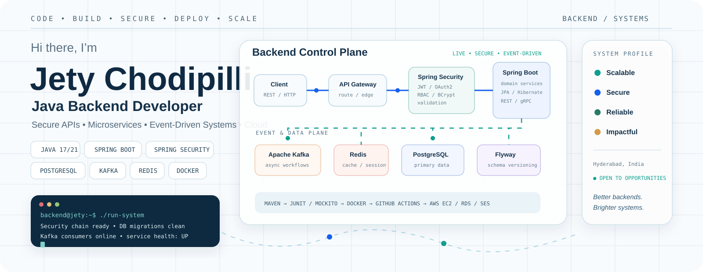
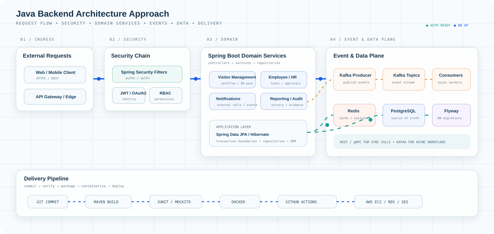
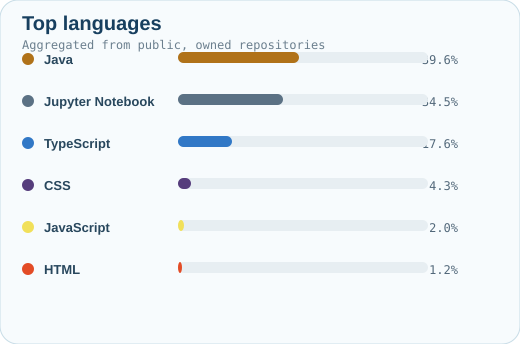

  

---

## Professional Summary

I’m a Java Backend Developer who enjoys working on systems where the backend has real responsibility — permissions, approvals, state changes, notifications, audit trails, and the rules that keep a product consistent when several roles are using it at the same time.

Most of my work is around Spring Boot applications, secure APIs, microservices, event-driven workflows, and database-backed business logic. I like projects where there is an actual flow to reason about, not just CRUD endpoints behind a dashboard.

---

## Backend Tech Stack

<table>
  <tr>
    <td><strong>Languages</strong></td>
    <td>Java 8 / 17 / 21, Python</td>
  </tr>
  <tr>
    <td><strong>Frameworks</strong></td>
    <td>Spring Boot, Spring MVC, Spring Security, Spring Cloud, Spring Data JPA, Hibernate ORM, WebFlux</td>
  </tr>
  <tr>
    <td><strong>APIs & System Design</strong></td>
    <td>REST APIs, Microservices, Event-Driven Architecture, gRPC, Protocol Buffers, API Gateway, Eureka, SOAP</td>
  </tr>
  <tr>
    <td><strong>Databases</strong></td>
    <td>PostgreSQL, MySQL, MongoDB, JPA / Hibernate</td>
  </tr>
  <tr>
    <td><strong>Messaging</strong></td>
    <td>Apache Kafka — producers, consumers, topics, event-driven patterns</td>
  </tr>
  <tr>
    <td><strong>Cloud & DevOps</strong></td>
    <td>AWS EC2, RDS, SES, Docker, GitHub Actions, GitLab CI, Git</td>
  </tr>
  <tr>
    <td><strong>Security</strong></td>
    <td>Spring Security, OAuth 2.0, JWT, RBAC, BCrypt, secure coding practices</td>
  </tr>
  <tr>
    <td><strong>Testing</strong></td>
    <td>JUnit 5, Mockito, unit and integration testing</td>
  </tr>
  <tr>
    <td><strong>Tools</strong></td>
    <td>IntelliJ IDEA, Eclipse / STS, Postman, Maven, MobaXterm</td>
  </tr>
</table>

  

---

## Selected Engineering Work

<table>
  <tr>
    <td width="68%" valign="top">

### BrainServe Connect
**Enterprise Visitor & Workforce Management Platform**

BrainServe Connect is the kind of backend project I enjoy because the system has to coordinate people, permissions, approvals, notifications, and permanent operational history without letting one role jump ahead of another.

The visitor flow moves from **Security intake → Reception verification → HR review → Team Lead / Employee / CEO approval → QR visitor pass → check-in / completion**.

The backend uses seven-role RBAC for System Admin, CEO, HR Admin, Team Lead, Employee, Receptionist, and Security. Kafka carries internal calls and workflow notifications, PostgreSQL stores the operational record, Redis supports fast state access, and Flyway keeps schema changes versioned with the application.

**Backend work**
- department-based employee onboarding
- Team Lead assignment and task worksheets
- employee progress tracking and HR insights
- account approval and password recovery
- profile management and termination approval
- audit trails and permanent operational logs
- Kafka-based internal calls and workflow notifications
- PostgreSQL persistence, Redis support and Flyway migrations
- Spring Security, BCrypt, RBAC and validated state transitions

**Stack:** Java 21 · Spring Boot 3 · Spring Security · Spring Data JPA · PostgreSQL · Apache Kafka · Redis · Flyway · Maven · Docker · REST APIs

[**Live Demo**](https://brain-serve-connect-vercel-demo.vercel.app/)  
[**Demo Repository**](https://github.com/JetyChodipilli/Brainserve-Connect-client-demo)

</td>
    <td width="32%" valign="top">

### Client Onboarding Platform

I built this around a simple problem: onboarding workflows become hard to trust when templates, permissions, projects, and audit history all change independently.

The backend stays as one Spring Boot deployable, but the domain boundaries are explicit. Published workflow versions are immutable, and onboarding starts from a snapshot so a running process does not silently change when a template is edited later.

**Highlights**
- multi-tenant backend design
- RBAC and MFA
- PostgreSQL + Flyway
- workflow versioning
- immutable onboarding snapshots
- dependency validation
- integration and architecture tests

[Repository](https://github.com/JetyChodipilli/Client-Onboarding)

</td>
  </tr>
</table>

<table>
  <tr>
    <td width="50%" valign="top">

### Healthcare Patient Management System

This repo is where I worked more directly with service boundaries.

The system is split into Patient, Billing, Analytics, Auth, and API Gateway services. Patient-to-Billing communication uses gRPC + Protocol Buffers, Kafka decouples analytics ingestion, and JWT authentication is enforced behind Spring Cloud Gateway.

**Architecture**
- five-service microservices system
- gRPC + Protocol Buffers
- Kafka consumer groups
- Spring Cloud Gateway
- JWT authentication
- Docker + PostgreSQL

[Repository](https://github.com/JetyChodipilli/Healthcare-Patient-Management-System-Microservice)

</td>
    <td width="50%" valign="top">

### Supporting Backend Work

- [Payment Processing Microservice](https://github.com/JetyChodipilli/Payment-Processing-Microservice-with-Stripe-and-MySQL) — Stripe charge flow with MySQL persistence.
- [AWS SES Email Service](https://github.com/JetyChodipilli/AWS-SES-EmailSend-SpringBoot) — email state handling around AWS SES delivery.
- [Spring Batch Processing](https://github.com/JetyChodipilli/Spring-Batch-Processing) — CSV ingestion and chunk-based processing.
- [API Gateway Realtime Project](https://github.com/JetyChodipilli/API-Gateway-Realtime-Project) — gateway and routing experiments.
- [Spring Cloud API Gateway](https://github.com/JetyChodipilli/Spring-Cloud-ApiGateway) — Spring Cloud Gateway and Eureka exploration.

</td>
  </tr>
</table>

---

## Java Backend Architecture Approach

  

### Request path

`Client → API Gateway → Spring Security → JWT / OAuth2 / RBAC → Controller → Service → Repository → PostgreSQL`

### Event path

`Domain Service → Kafka Producer → Topic → Consumer → Notification / Internal Workflow / Analytics`

### Data path

`Spring Boot Service → JPA / Hibernate → PostgreSQL`  
`Spring Boot Service → Redis for cache / session state`  
`Flyway → versioned schema migration → database`

### Delivery path

`Git Commit → Maven Build → JUnit / Mockito → Docker → GitHub Actions / GitLab CI → AWS`

---

## Architecture Principles

<table>
  <tr>
    <td width="25%" valign="top">

### Security at the edge
Authentication and authorization happen before business logic. Resource-level permission checks still remain inside the application.

</td>
    <td width="25%" valign="top">

### Database as source of truth
PostgreSQL / MySQL owns transactional business state. Redis is supporting infrastructure, not the authoritative record.

</td>
    <td width="25%" valign="top">

### Sync and async have different jobs
REST or gRPC handles direct request/response work. Kafka handles workflows that should not block on downstream processing.

</td>
    <td width="25%" valign="top">

### Delivery is part of architecture
Migrations, tests, containers, CI/CD, and deployment are treated as part of the system rather than afterthoughts.

</td>
  </tr>
</table>

---

## Language Profile

  

The language card is generated inside this profile repository from public repositories, so it does not rely on an external stats-card service.

**Primary backend language:** Java  
**Secondary language from resume:** Python

---

## Contribution Trail

  <picture>
    <source media="(prefers-color-scheme: dark)" srcset="https://raw.githubusercontent.com/JetyChodipilli/JetyChodipilli/output/github-contribution-grid-snake-dark.svg" />
    <source media="(prefers-color-scheme: light)" srcset="https://raw.githubusercontent.com/JetyChodipilli/JetyChodipilli/output/github-contribution-grid-snake.svg" />
    
  </picture>

---

## Current Friction

I prefer leaving a few rough edges visible instead of pretending every repo is finished.

- **BrainServe demo** is a public client walkthrough, not the production backend.
- **Client Onboarding** is stronger in workflow and architecture work than in presentation polish right now.
- **Payment Processing** still needs more production hardening around request validation, idempotency, and error handling.
- I keep refining how much infrastructure a project actually needs before adding another moving part.

---

## If You’re Reviewing My Work

1. [**BrainServe Connect Live Demo**](https://brain-serve-connect-vercel-demo.vercel.app/) — enterprise workflow and product flow.
2. [**Client Onboarding Platform**](https://github.com/JetyChodipilli/Client-Onboarding) — workflow engine, multi-tenancy, RBAC, persistence and testing.
3. [**Healthcare Patient Management System**](https://github.com/JetyChodipilli/Healthcare-Patient-Management-System-Microservice) — microservices, gRPC, Kafka and Spring Cloud.
4. [**AWS SES Email Service**](https://github.com/JetyChodipilli/AWS-SES-EmailSend-SpringBoot) — AWS integration and delivery-state persistence.

---

## Connect

**GitHub:** [JetyChodipilli](https://github.com/JetyChodipilli)  
**Location:** Hyderabad, India  
**Status:** Open to Opportunities

---

Java Backend Development • Spring Boot • Microservices • Kafka • PostgreSQL • AWS • Security • System Design
