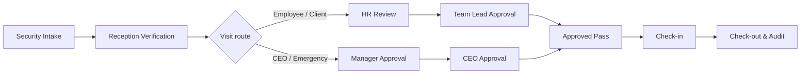

<table>
<tr>
<td width="68%" valign="middle">

# Jety Chodipilli

### Jr. Java Developer @ Brainserve Groups Pvt. Ltd.
### Java Backend · Spring Boot · System Design

I work on backend systems where the difficult part is keeping **security, workflow state, transactions, messaging and recovery** correct as the application grows.

My day-to-day stack is centered on **Java, Spring Boot, PostgreSQL, Kafka and Redis**. I also work with Spring Security, Flyway, Docker, Testcontainers and GitHub Actions.

📍 **Hyderabad, India**  
💼 **Current:** Jr. Java Developer, Brainserve Groups Pvt. Ltd.  
🔎 **Open to:** Java Backend / Spring Boot opportunities

[**BrainServe Live Demo**](https://brain-serve-connect-vercel-demo.vercel.app/) · [**Portfolio**](https://jetychportfolio.netlify.app/) · [**LinkedIn**](https://www.linkedin.com/in/jetychodipilli) · [**ORCID**](https://orcid.org/0009-0008-8585-051X)

</td>
<td width="32%" align="center" valign="middle">

**Java 17 / 21**  
**Spring Boot · PostgreSQL**  
**Kafka · Redis · Security**

</td>
</tr>
</table>

---

## Current work

At **Brainserve Groups Pvt. Ltd.**, I work on Java/Spring Boot application development and internal product engineering.

The main system behind that work is **BrainServe Connect**, a visitor and workforce operations platform with role-based approvals, employee workflows, notifications, access control, reporting and audit history.

The backend work includes:

- Spring Security with JWT, role checks and resource-level authorization
- PostgreSQL transactions and Flyway-managed schema changes
- Redis for OTP state, rate limits and dashboard caching
- Kafka for asynchronous internal-call delivery
- transaction-aware notification and outbox processing
- retry and recovery paths around database and service failures
- QR visitor passes, check-in/check-out and audit history
- pagination, bounded queries and concurrency protection
- browser multi-tab coordination for live updates
- health/readiness endpoints and operational diagnostics
- automated source/regression and browser verification

---

# BrainServe Connect

### Enterprise Visitor & Workforce Operations Platform

[**Live Demo →**](https://brain-serve-connect-vercel-demo.vercel.app/) · [**Public Demo Repository →**](https://github.com/JetyChodipilli/Brainserve-Connect-client-demo) · [**Public Implementation Snapshot →**](https://github.com/JetyChodipilli/V2_Brainserve_Connect_gstack)

The primary BrainServe Connect source repository is private. The public demo and implementation snapshot expose enough of the product and architecture to review the system without publishing the working production repository.

### Production stack

| Area | Implementation |
|---|---|
| **Backend** | Java 21, Spring Boot 3.5.7, Spring Modulith |
| **Security** | Spring Security, JWT, role/scope checks |
| **Data** | PostgreSQL 17.2, JPA/Hibernate, Flyway |
| **State** | Redis 7.4.1 for OTPs, rate limits and dashboard caching |
| **Messaging** | Apache Kafka 3.9.1, three-node KRaft cluster |
| **Files** | S3-compatible storage, ClamAV scanning, controlled downloads |
| **Operations** | Actuator, Micrometer, health/readiness endpoints |
| **Delivery** | Maven, Docker, GitHub Actions |

### Engineering details

- authorization and workflow state are enforced by the backend rather than UI controls
- visitor and employee actions move through validated lifecycle transitions
- Kafka work is kept outside the request transaction through durable messaging/outbox patterns
- private uploads are scanned before they become available for controlled download
- Redis has specific responsibilities: short-lived security state, rate limiting and scoped cache data
- database reconnect and recovery behavior is treated as an application concern, not only an infrastructure concern
- one browser tab owns background live updates while other tabs receive coordinated state
- the verified application snapshot includes **263 passing Node source/regression tests**, with separate browser verification

### Visitor path

```mermaid
flowchart LR
    A["Security Intake"] --> B["Reception Verification"]
    B --> C{"Visit route"}
    C -->|Employee / Client| D["HR Review"]
    D --> E["Team Lead Approval"]
    C -->|CEO / Emergency| F["Manager Approval"]
    F --> G["CEO Approval"]
    E --> H["Approved Pass"]
    G --> H
    H --> I["Check-in"]
    I --> J["Check-out & Audit"]
```

---

## Client Onboarding Platform

**Multi-tenant onboarding · versioned workflows · secure assets · client portal**

[**Repository →**](https://github.com/JetyChodipilli/Client-Onboarding)

A Spring Boot modular monolith for organizations, clients, projects and onboarding workflows.

I kept it as one deployable backend on purpose. The hard problem here is not service-to-service networking; it is keeping tenancy, workflow definitions, active onboarding runs, permissions and audit history consistent while the product changes.

Current public implementation includes:

- tenant membership, RBAC, TOTP MFA and security audit records
- clients, contacts, projects and lifecycle transitions
- versioned workflow templates with immutable published versions
- dependency graphs with cycle and invalid-edge rejection
- client invitations, project grants and portal access
- reusable questionnaires with review/revision history
- private asset uploads with SHA-256/MIME validation and ClamAV scanning
- Testcontainers, ArchUnit and browser-level verification

The current main branch CI is green. The published Phase 6 verification records **55 backend tests, 12 frontend unit tests and 89 browser scenarios passing**.

The design decision I care about most in this project: an onboarding run keeps the exact workflow version it started with. Editing a template later cannot silently rewrite an active customer's process.

---

## SeatEngine / SeatSure

**Distributed booking · locking · idempotency · event delivery**

[**Repository →**](https://github.com/JetyChodipilli/SeatEngine)

A booking-system project used to work through concurrency and failure cases rather than only the booking happy path.

- Redis, pessimistic JPA and optimistic JPA locking strategies
- database-enforced idempotency for booking/payment operations
- payment saga with compensating hold release
- transactional outbox and Kafka delivery
- consumer deduplication and dead-letter topics
- Resilience4j, health metrics and distributed tracing

I keep this as a supporting architecture project rather than treating it as production evidence.

---

## Earlier microservices work

### Healthcare Patient Management System

[**Repository →**](https://github.com/JetyChodipilli/Healthcare-Patient-Management-System-Microservice)

A **course-based learning project** I used to practice Spring Boot microservices, Spring Cloud Gateway, Kafka, gRPC, Protocol Buffers, JWT and PostgreSQL.

I label it as learning work intentionally. BrainServe Connect and Client Onboarding are better examples of my own architecture and implementation decisions.

---

## Stack I use

| Area | Technologies |
|---|---|
| **Java & Spring** | Java 17/21, Spring Boot, Spring MVC, Spring Security, Spring Data JPA, Hibernate, Spring Modulith |
| **Architecture** | REST APIs, modular monoliths, microservices, event-driven workflows |
| **Data** | PostgreSQL, MySQL, Flyway |
| **Messaging & state** | Apache Kafka, Redis |
| **Security** | JWT, RBAC, MFA, BCrypt, resource-level authorization |
| **Testing** | JUnit 5, Mockito, Testcontainers, ArchUnit, integration and browser testing |
| **Delivery** | Maven, Docker, GitHub Actions |
| **Communication** | gRPC, Protocol Buffers |
| **Integration** | AWS SES, S3-compatible storage |

---

## More public backend work

| Repository | Focus |
|---|---|
| [Payment Processing Microservice](https://github.com/JetyChodipilli/Payment-Processing-Microservice-with-Stripe-and-MySQL) | payment integration and persistence |
| [AWS SES Email Service](https://github.com/JetyChodipilli/AWS-SES-EmailSend-SpringBoot) | transactional email integration |
| [Employee Management System](https://github.com/JetyChodipilli/EmployeeManagementSystem) | employee records, uploads and reporting |
| [Spring Batch Processing](https://github.com/JetyChodipilli/Spring-Batch-Processing) | batch processing |
| [Spring Boot File Processing API](https://github.com/JetyChodipilli/Spring-Boot-File-Processing-API) | file-processing APIs |

---

## Connect

[**LinkedIn**](https://www.linkedin.com/in/jetychodipilli) · [**Portfolio**](https://jetychportfolio.netlify.app/) · [**BrainServe Demo**](https://brain-serve-connect-vercel-demo.vercel.app/) · [**ORCID**](https://orcid.org/0009-0008-8585-051X)

**Java Backend · Spring Boot · Security · System Design**
