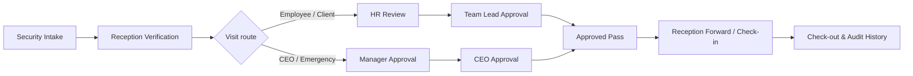

<table>
<tr>
<td width="68%" valign="middle">

### Hi, I'm

# Jety Chodipilli

## Java Backend Developer · Spring Boot · System Design

I build backend systems where **security, workflow state, data consistency and reliability** matter — using Java, Spring Boot, PostgreSQL, Kafka, Redis and Docker.

I focus on more than controller-level CRUD: **authorization, transactions, event-driven processing, failure recovery, auditability and production-oriented testing**.

  
  
  
  
  
  

📍 **Hyderabad, India**  
💼 **Open to Java Backend / Spring Boot opportunities**

[**BrainServe Live Demo**](https://brain-serve-connect-vercel-demo.vercel.app/) · [**Portfolio**](https://jetychportfolio.netlify.app/) · [**ORCID**](https://orcid.org/0009-0008-8585-051X) · [**Repositories**](https://github.com/JetyChodipilli?tab=repositories)

</td>
<td width="32%" align="center" valign="middle">

**Backend Engineering**  
**Security · Workflows · Distributed Systems**

</td>
</tr>
</table>

---

## Engineering Snapshot

| What I work on | Evidence in my projects |
|---|---|
| **Secure backend systems** | Spring Security, JWT, RBAC, MFA, resource-level authorization and audit trails |
| **Stateful business workflows** | Multi-role approvals, immutable workflow versions, lifecycle transitions and recovery paths |
| **Event-driven processing** | Apache Kafka, durable messaging, internal-call delivery and asynchronous notifications |
| **Reliable persistence** | PostgreSQL, JPA/Hibernate, Flyway migrations, transaction boundaries and idempotency patterns |
| **Operational state** | Redis for OTPs, rate limits, caching and short-lived coordination |
| **Verification** | JUnit, Mockito, Testcontainers, ArchUnit, browser tests and CI pipelines |
| **Delivery** | Docker, Maven, GitHub Actions and deployable demo environments |

---

## Flagship Project · BrainServe Connect

### Enterprise Visitor & Workforce Operations Platform

[**Live Demo →**](https://brain-serve-connect-vercel-demo.vercel.app/) · [**Main Repository →**](https://github.com/JetyChodipilli/Brainserve-connect-Appointment-System) · [**Client Demo Repository →**](https://github.com/JetyChodipilli/Brainserve-Connect-client-demo)

BrainServe Connect is a production-oriented workplace operations platform with a **React/TypeScript frontend and Java 21 Spring Boot backend**.

It coordinates visitor intake, approvals, employee operations, notifications and audit history across organizational roles while keeping authorization and business decisions on the backend.

### Engineering proof

- **Java 21 + Spring Boot 3.5.7 + Spring Modulith**
- **PostgreSQL 17.2** as the durable business data store
- **3-node Kafka KRaft cluster** for internal-call delivery
- **Redis 7.4.1** for OTP state, rate limits and dashboard caching
- Spring Security with JWT, active-account and scope checks
- Flyway-managed schema evolution
- transactional email/outbox processing
- private object storage, malware scanning and controlled downloads
- health/readiness and metrics support
- verified project snapshot records **263 Node source/regression tests passed with zero failures**, with additional browser verification

### Core visitor flow

```mermaid
flowchart LR
    A["Security Intake"] --> B["Reception Verification"]
    B --> C{"Visit route"}
    C -->|Employee / Client| D["HR Review"]
    D --> E["Team Lead Approval"]
    C -->|CEO / Emergency| F["Manager Approval"]
    F --> G["CEO Approval"]
    E --> H["Approved Pass"]
    G --> H
    H --> I["Reception Forward / Check-in"]
    I --> J["Check-out & Audit History"]
```

The design goal is simple: **the UI can assist the workflow, but the backend remains authoritative for identity, permissions, state transitions and durable history.**

---

## Selected Projects

### Client Onboarding Platform
**Multi-tenant onboarding, workflow execution and client portal**

A Spring Boot modular monolith built around a problem I find interesting: workflow definitions change, but work already in progress still needs to remain explainable.

Published workflow versions are immutable. New onboarding runs store an exact snapshot so existing processes do not silently change when templates are edited later.

**Focus:** multi-tenancy · RBAC · MFA · workflow versioning · immutable snapshots · PostgreSQL · Flyway · Testcontainers · ArchUnit · asset management

[**Repository →**](https://github.com/JetyChodipilli/Client-Onboarding)

---

### SeatEngine
**Distributed movie-booking backend**

Explores the consistency problems behind seat reservation and payment rather than treating booking as simple CRUD.

**Focus:** Spring Boot microservices · JWT gateway security · Redis/JPA seat locking · idempotent booking/payment · Kafka outbox events · resilience · observability

[**Repository →**](https://github.com/JetyChodipilli/SeatEngine)

---

### Healthcare Patient Management System
**Microservices learning implementation**

A course-based learning build used to practice service boundaries and distributed communication across Patient, Billing, Analytics, Auth and API Gateway services.

**Focus:** Spring Boot · Spring Cloud Gateway · gRPC · Protocol Buffers · Kafka · JWT · PostgreSQL · Docker

[**Repository →**](https://github.com/JetyChodipilli/Healthcare-Patient-Management-System-Microservice)

---

### OpsHub
**Workforce & operations platform baseline**

A modular Spring Boot backend exploring resource-scoped authorization and reliable event publication.

**Focus:** PostgreSQL · Kafka outbox/inbox · optional Redis · scoped authorization · modular architecture

[**Repository →**](https://github.com/JetyChodipilli/OpsHub)

---

## How I Design Backends

I try to make architectural choices based on the failure modes and consistency requirements of the product rather than the number of technologies I can place in a diagram.

- **Security belongs on the server.** UI visibility is not authorization.
- **Transactions have clear ownership.** Business invariants should fail or commit together.
- **Async work becomes durable before delivery.** Messaging is useful when it reduces coupling without hiding failures.
- **Schema changes are versioned.** Flyway migrations are part of application delivery.
- **Workflow history remains explainable.** State changes, actors and important decisions should be auditable.
- **Distributed components need a reason to exist.** A modular monolith is often better than premature microservices.
- **Failure recovery is a product feature.** Timeouts, retries, reconnects and partial failures are designed deliberately.
- **Tests protect boundaries, not just methods.** Integration, architecture and browser-level verification matter alongside unit tests.

---

## Backend Toolkit

| Area | Technologies |
|---|---|
| **Java & Spring** | Java 8 / 17 / 21, Spring Boot, Spring MVC, Spring Security, Spring Data JPA, Hibernate, Spring Modulith |
| **Architecture** | REST APIs, modular monoliths, microservices, event-driven architecture, gRPC, Protocol Buffers |
| **Data** | PostgreSQL, MySQL, MongoDB, Flyway |
| **Messaging & State** | Apache Kafka, Redis |
| **Security** | JWT, OAuth 2.0, RBAC, MFA, BCrypt, request validation |
| **Testing** | JUnit 5, Mockito, Testcontainers, ArchUnit, integration and browser testing |
| **Delivery** | Maven, Docker, GitHub Actions, GitLab CI, AWS EC2 / RDS / SES |
| **Tools** | IntelliJ IDEA, Postman, Git, Linux |

  

---

## More Backend Work

| Repository | Engineering focus |
|---|---|
| [Payment Processing Microservice](https://github.com/JetyChodipilli/Payment-Processing-Microservice-with-Stripe-and-MySQL) | Payment integration and persistence learning project |
| [AWS SES Email Service](https://github.com/JetyChodipilli/AWS-SES-EmailSend-SpringBoot) | Email delivery with AWS SES |
| [Employee Management System](https://github.com/JetyChodipilli/EmployeeManagementSystem) | Spring MVC, employee records, action history, uploads and reporting |
| [Spring Batch Processing](https://github.com/JetyChodipilli/Spring-Batch-Processing) | Batch-oriented Spring processing |
| [Spring Boot File Processing API](https://github.com/JetyChodipilli/Spring-Boot-File-Processing-API) | File-processing API patterns |
| [API Gateway Realtime Project](https://github.com/JetyChodipilli/API-Gateway-Realtime-Project) | Gateway and distributed application learning |

---

## ORCID & Technical Identity

I use ORCID as my persistent identifier for **research, technical publications and citable engineering work**.

My GitHub remains the source of truth for code. As I publish technical papers, archived software releases or other citable engineering work, I will connect those outputs to the same ORCID identity.

---

## Contribution Activity

  <picture>
    <source media="(prefers-color-scheme: dark)" srcset="https://raw.githubusercontent.com/JetyChodipilli/JetyChodipilli/output/github-contribution-grid-snake-dark.svg" />
    <source media="(prefers-color-scheme: light)" srcset="https://raw.githubusercontent.com/JetyChodipilli/JetyChodipilli/output/github-contribution-grid-snake.svg" />
    
  </picture>

---

## Connect

  
  
  
  

**Hyderabad, India** · **Java Backend / Spring Boot** · **Backend Engineering · Security · System Design**

---

  <strong>Java · Spring Boot · Spring Security · PostgreSQL · Kafka · Redis · Docker</strong>

