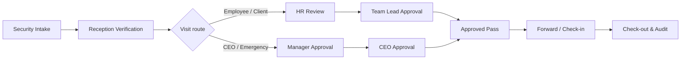

<table>
<tr>
<td width="68%" valign="middle">

### Hi, I'm

# Jety Chodipilli

## Java Backend Developer · Spring Boot · System Design

I build backend systems where **permissions, workflow state, data consistency and failure recovery** actually matter.

My work is centered on **Java, Spring Boot, PostgreSQL, Kafka, Redis and Docker** — with a focus on secure APIs, transactional business logic, event-driven processing, auditability and production-oriented testing.

  
  
  
  
  
  

📍 **Hyderabad, India**  
💼 **Open to Java Backend / Spring Boot opportunities**

[**BrainServe Live Demo**](https://brain-serve-connect-vercel-demo.vercel.app/) · [**Portfolio**](https://jetychportfolio.netlify.app/) · [**ORCID**](https://orcid.org/0009-0008-8585-051X)

</td>
<td width="32%" align="center" valign="middle">

**Backend Engineering**  
**Security · Workflows · Distributed Systems**

</td>
</tr>
</table>

---

## What I Build

I like backend work where the hard part is not creating an endpoint — it is keeping the system correct when **multiple roles, state transitions, asynchronous work and partial failures** are involved.

| Focus | What that means in my projects |
|---|---|
| **Security** | Spring Security, JWT, RBAC, MFA, resource-level authorization |
| **Workflow systems** | approval chains, lifecycle transitions, immutable workflow versions, audit history |
| **Data consistency** | PostgreSQL, JPA/Hibernate, transactions, Flyway migrations, idempotency |
| **Event-driven work** | Kafka, durable messaging, async notifications, outbox-style delivery |
| **Operational state** | Redis for OTPs, caching, rate limiting and short-lived coordination |
| **Verification** | unit, integration, architecture and browser-level tests |
| **Delivery** | Maven, Docker, GitHub Actions and deployable demo environments |

---

# Flagship · BrainServe Connect

### Enterprise Visitor & Workforce Operations Platform

[**Live Demo →**](https://brain-serve-connect-vercel-demo.vercel.app/) · [**Main Repository →**](https://github.com/JetyChodipilli/Brainserve-connect-Appointment-System)

BrainServe Connect is the project that best represents how I approach backend engineering.

It combines a **React/TypeScript frontend with a Java 21 Spring Boot backend** and coordinates visitor intake, approvals, employee operations, notifications, reporting and audit history across multiple organizational roles.

### Engineering proof

- **Java 21 · Spring Boot 3.5.7 · Spring Modulith**
- **PostgreSQL 17.2** for durable business state
- **3-node Kafka KRaft cluster** for internal-call delivery
- **Redis 7.4.1** for OTP state, rate limits and dashboard caching
- Spring Security with JWT, active-account and scoped authorization checks
- Flyway-managed schema evolution
- transactional email/outbox processing
- private file storage with malware scanning and controlled downloads
- health/readiness endpoints and metrics support
- verified snapshot: **263 Node source/regression tests passed, 0 failed**, plus separate browser verification

### Core visitor flow

```mermaid
flowchart LR
    A["Security Intake"] --> B["Reception Verification"]
    B --> C{"Visit route"}
    C -->|Employee / Client| D["HR Review"]
    D --> E["Team Lead Approval"]
    C -->|CEO / Emergency| F["Manager Approval"]
    F --> G["CEO Approval"]
    E --> H["Approved Pass"]
    G --> H
    H --> I["Forward / Check-in"]
    I --> J["Check-out & Audit"]
```

**Design principle:** the frontend can guide the workflow, but the backend remains authoritative for identity, permissions, state transitions and durable history.

---

## Selected Engineering Work

### Client Onboarding Platform
**Multi-tenant onboarding · versioned workflows · client portal**

A Spring Boot modular monolith designed around a specific consistency problem: workflow definitions can change, but onboarding already in progress must remain explainable.

Published workflow versions are immutable, and each onboarding run stores the exact version it started from.

**Built around:** Java 17 · Spring Boot · Spring Security · PostgreSQL · Flyway · MFA · Testcontainers · ArchUnit

[**Repository →**](https://github.com/JetyChodipilli/Client-Onboarding)

---

### SeatEngine
**Distributed booking · locking · idempotency**

A backend-focused movie booking system exploring what happens when multiple users compete for the same seats and payment must remain consistent with reservation state.

**Built around:** Spring Boot · Redis/JPA locking · JWT gateway security · Kafka outbox events · idempotent booking/payment · resilience

[**Repository →**](https://github.com/JetyChodipilli/SeatEngine)

---

### OpsHub
**Workforce operations · modular architecture · reliable events**

A modular Spring Boot platform exploring resource-scoped authorization and durable event publication.

**Built around:** PostgreSQL · Kafka outbox/inbox patterns · optional Redis · scoped authorization

[**Repository →**](https://github.com/JetyChodipilli/OpsHub)

---

### Healthcare Patient Management System
**Microservices learning build**

A course-based implementation I used to practice service boundaries and distributed communication across Patient, Billing, Analytics, Auth and API Gateway services.

**Built around:** Spring Boot · Spring Cloud Gateway · gRPC · Protocol Buffers · Kafka · JWT · PostgreSQL · Docker

[**Repository →**](https://github.com/JetyChodipilli/Healthcare-Patient-Management-System-Microservice)

---

## How I Think About Backend Design

- **Authorization belongs on the server.** Hiding a button is not a security boundary.
- **Transactions should own business invariants.** Related state should commit or fail together.
- **Async work should become durable before delivery.** Messaging should reduce coupling without hiding failures.
- **Schema changes are application changes.** Database migrations belong in version control and delivery.
- **Workflow history should remain explainable.** State changes, actors and decisions need durable history.
- **Distributed systems need justification.** I prefer a modular monolith when service boundaries are not yet worth the operational cost.
- **Failure recovery is part of product design.** Reconnects, retries, timeouts and degraded states should be intentional.
- **Tests should protect system boundaries.** Integration and architecture tests matter as much as isolated unit tests.

---

## Core Stack

| Area | Technologies I actively use |
|---|---|
| **Java & Spring** | Java 17/21, Spring Boot, Spring MVC, Spring Security, Spring Data JPA, Hibernate, Spring Modulith |
| **Backend Architecture** | REST APIs, modular monoliths, microservices, event-driven architecture |
| **Data** | PostgreSQL, MySQL, Flyway |
| **Messaging & State** | Apache Kafka, Redis |
| **Security** | JWT, RBAC, MFA, BCrypt, request validation |
| **Testing** | JUnit 5, Mockito, Testcontainers, ArchUnit, integration testing |
| **Delivery** | Maven, Docker, GitHub Actions |
| **Communication** | gRPC, Protocol Buffers |
| **Integration** | AWS SES |

  

---

## More Backend Repositories

| Repository | Focus |
|---|---|
| [Payment Processing Microservice](https://github.com/JetyChodipilli/Payment-Processing-Microservice-with-Stripe-and-MySQL) | payment integration and persistence learning |
| [AWS SES Email Service](https://github.com/JetyChodipilli/AWS-SES-EmailSend-SpringBoot) | transactional email integration |
| [Employee Management System](https://github.com/JetyChodipilli/EmployeeManagementSystem) | Spring MVC, employee records, uploads and reporting |
| [Spring Batch Processing](https://github.com/JetyChodipilli/Spring-Batch-Processing) | batch-oriented processing |
| [Spring Boot File Processing API](https://github.com/JetyChodipilli/Spring-Boot-File-Processing-API) | file-processing API patterns |
| [API Gateway Realtime Project](https://github.com/JetyChodipilli/API-Gateway-Realtime-Project) | gateway and distributed application learning |

---

## ORCID

I keep ORCID as my persistent identity for **future technical publications, research work and citable engineering outputs**. GitHub remains the source of truth for my code.

---

## Contribution Activity

  <picture>
    <source media="(prefers-color-scheme: dark)" srcset="https://raw.githubusercontent.com/JetyChodipilli/JetyChodipilli/output/github-contribution-grid-snake-dark.svg" />
    <source media="(prefers-color-scheme: light)" srcset="https://raw.githubusercontent.com/JetyChodipilli/JetyChodipilli/output/github-contribution-grid-snake.svg" />
    
  </picture>

---

## Connect

[**GitHub**](https://github.com/JetyChodipilli) · [**Portfolio**](https://jetychportfolio.netlify.app/) · [**BrainServe Demo**](https://brain-serve-connect-vercel-demo.vercel.app/) · [**ORCID**](https://orcid.org/0009-0008-8585-051X)

**Java Backend · Spring Boot · Security · System Design**
