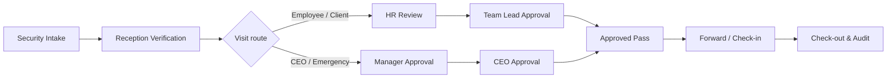

<table>
<tr>
<td width="68%" valign="middle">

### Hi, I'm

# Jety Chodipilli

## Java Backend Developer · Spring Boot · System Design

**Jr. Java Developer @ Brainserve Groups Pvt. Ltd.**

I work on Java/Spring Boot backends where **authorization, workflow state, transactions, asynchronous processing and recovery** need to stay correct as the application grows.

My day-to-day stack is **Java, Spring Boot, PostgreSQL, Kafka, Redis and Docker**.

  
  
  
  
  
  

📍 **Hyderabad, India**  
💼 **Current:** Jr. Java Developer @ Brainserve Groups Pvt. Ltd.  
🔎 **Open to Java Backend / Spring Boot opportunities**

[**BrainServe Live Demo**](https://brain-serve-connect-vercel-demo.vercel.app/) · [**Portfolio**](https://jetychportfolio.netlify.app/) · [**LinkedIn**](https://www.linkedin.com/in/jetychodipilli) · [**ORCID**](https://orcid.org/0009-0008-8585-051X)

</td>
<td width="32%" align="center" valign="middle">

**Backend Engineering**  
**Security · Workflows · Distributed Systems**

</td>
</tr>
</table>

---

## Backend Engineering Focus

| Focus | Working areas |
|---|---|
| **Security** | Spring Security, JWT, RBAC, MFA, resource-level authorization |
| **Workflow design** | approval chains, lifecycle transitions, workflow versioning, audit history |
| **Data & transactions** | PostgreSQL, JPA/Hibernate, transaction boundaries, Flyway migrations |
| **Messaging** | Kafka, transactional outbox, asynchronous notifications, durable event delivery |
| **State & coordination** | Redis for OTPs, caching, rate limiting and short-lived state |
| **Reliability** | idempotency, retries, recovery paths, concurrency handling and bounded queries |
| **Verification & delivery** | unit, integration, architecture and browser testing; Maven, Docker and GitHub Actions |

---

# Flagship · BrainServe Connect

### Enterprise Visitor & Workforce Operations Platform

[**Live Demo →**](https://brain-serve-connect-vercel-demo.vercel.app/) · [**Public Demo →**](https://github.com/JetyChodipilli/Brainserve-Connect-client-demo) · [**Public Implementation Snapshot →**](https://github.com/JetyChodipilli/V2_Brainserve_Connect_gstack)

BrainServe Connect is my main backend project and the system I work on at Brainserve Groups.

The primary working repository is private. The public demo and implementation snapshot expose the product flow and architecture without publishing the production codebase.

It uses a **React/TypeScript frontend and Java 21 Spring Boot backend** to handle visitor intake, approvals, employee operations, notifications, reporting and audit history across multiple organizational roles.

### Backend details

- **Java 21 · Spring Boot 3.5.7 · Spring Modulith**
- **PostgreSQL 17.2** for application data
- **3-node Kafka KRaft cluster** for internal-call delivery
- **Redis 7.4.1** for OTP state, rate limits and dashboard caching
- Spring Security with JWT and role/scope checks
- Flyway database migrations
- transactional email/outbox processing
- private file storage with malware scanning and controlled downloads
- health/readiness endpoints and metrics
- verified snapshot: **263 Node source/regression tests passed, 0 failed**, with separate browser verification

### Visitor flow

```mermaid
flowchart LR
    A["Security Intake"] --> B["Reception Verification"]
    B --> C{"Visit route"}
    C -->|Employee / Client| D["HR Review"]
    D --> E["Team Lead Approval"]
    C -->|CEO / Emergency| F["Manager Approval"]
    F --> G["CEO Approval"]
    E --> H["Approved Pass"]
    G --> H
    H --> I["Forward / Check-in"]
    I --> J["Check-out & Audit"]
```

Authorization and workflow state are enforced by the backend rather than relying on UI controls.

---

## Selected Engineering Work

### Client Onboarding Platform
**Multi-tenant onboarding · versioned workflows · secure assets · client portal**

A Spring Boot modular monolith for organizations, clients, projects and onboarding workflows.

I kept the backend as one deployable application deliberately: the harder problem here is maintaining tenant boundaries, workflow state and audit history consistently while the product evolves.

Published workflow versions are immutable, so active onboarding runs keep the exact version they started with even when templates change later.

The current public implementation includes tenant RBAC, TOTP MFA, secure client invitations, questionnaires, private asset uploads, ClamAV scanning and architecture verification with Testcontainers and ArchUnit.

**Verified Phase 6 gate:** 55 backend tests · 12 frontend unit tests · 89 browser scenarios passed.

**Stack:** Java 17 · Spring Boot · Spring Security · PostgreSQL · Flyway · MFA · Testcontainers · ArchUnit

[**Repository →**](https://github.com/JetyChodipilli/Client-Onboarding)

---

### SeatEngine / SeatSure
**Distributed booking · locking · idempotency**

A booking-system project focused on one concrete concurrency problem: multiple users can request the same limited resource, but only one booking should win.

The project explores Redis, pessimistic and optimistic JPA locking, database-backed idempotency, payment compensation, Kafka outbox delivery, consumer deduplication and dead-letter handling.

**Stack:** Spring Boot · Redis/JPA locking · JWT gateway security · Kafka outbox events · idempotent booking/payment

[**Repository →**](https://github.com/JetyChodipilli/SeatEngine)

---

### Healthcare Patient Management System
**Microservices learning project**

A course-based project I used to practice service-to-service communication across Patient, Billing, Analytics, Auth and API Gateway services.

**Stack:** Spring Boot · Spring Cloud Gateway · gRPC · Protocol Buffers · Kafka · JWT · PostgreSQL · Docker

[**Repository →**](https://github.com/JetyChodipilli/Healthcare-Patient-Management-System-Microservice)

---

## Backend Decisions I Care About

- authorization is enforced server-side; hiding a control in the UI is not a security boundary
- transaction boundaries follow the business change that must succeed or fail together
- schema changes are versioned with Flyway instead of being applied manually
- Kafka is used when asynchronous or durable delivery solves a real workflow problem
- Redis is used for short-lived state, caching and coordination rather than as the source of truth
- retries are designed together with idempotency and recovery behavior
- tests cover integration boundaries and failure paths, not only happy-path methods

---

## Backend Stack

| Area | Technologies I use |
|---|---|
| **Java & Spring** | Java 17/21, Spring Boot, Spring MVC, Spring Security, Spring Data JPA, Hibernate, Spring Modulith |
| **API & architecture** | REST APIs, modular monoliths, microservices, event-driven systems |
| **Persistence** | PostgreSQL, MySQL, JPA/Hibernate, Flyway |
| **Messaging & state** | Apache Kafka, Redis, transactional outbox patterns |
| **Security** | JWT, RBAC, MFA, BCrypt, request validation, resource-level authorization |
| **Reliability & concurrency** | idempotency, optimistic/pessimistic locking, retries, recovery paths |
| **Testing** | JUnit 5, Mockito, Testcontainers, ArchUnit, integration testing |
| **Observability** | Spring Boot Actuator, Micrometer, health/readiness endpoints |
| **Delivery** | Maven, Docker, GitHub Actions |
| **Service communication** | REST, gRPC, Protocol Buffers |
| **External integration** | AWS SES, S3-compatible storage |

  
  &nbsp;&nbsp;
  
  &nbsp;&nbsp;
  
  &nbsp;&nbsp;
  
  &nbsp;&nbsp;
  
  &nbsp;&nbsp;
  
  &nbsp;&nbsp;
  
  &nbsp;&nbsp;
  
  &nbsp;&nbsp;
  
  &nbsp;&nbsp;
  

---

## More Backend Repositories

| Repository | Focus |
|---|---|
| [Payment Processing Microservice](https://github.com/JetyChodipilli/Payment-Processing-Microservice-with-Stripe-and-MySQL) | payment integration and persistence |
| [AWS SES Email Service](https://github.com/JetyChodipilli/AWS-SES-EmailSend-SpringBoot) | email delivery with AWS SES |
| [Employee Management System](https://github.com/JetyChodipilli/EmployeeManagementSystem) | employee records, uploads and reporting |
| [Spring Batch Processing](https://github.com/JetyChodipilli/Spring-Batch-Processing) | batch processing |
| [Spring Boot File Processing API](https://github.com/JetyChodipilli/Spring-Boot-File-Processing-API) | file-processing APIs |

---

## Research Identity

I keep ORCID for citable technical and research work; source code stays on GitHub.

---

## Contribution Activity

  <picture>
    <source media="(prefers-color-scheme: dark)" srcset="https://raw.githubusercontent.com/JetyChodipilli/JetyChodipilli/output/github-contribution-grid-snake-dark.svg" />
    <source media="(prefers-color-scheme: light)" srcset="https://raw.githubusercontent.com/JetyChodipilli/JetyChodipilli/output/github-contribution-grid-snake.svg" />
    
  </picture>

---

## Professional Links

[**GitHub**](https://github.com/JetyChodipilli) · [**LinkedIn**](https://www.linkedin.com/in/jetychodipilli) · [**Portfolio**](https://jetychportfolio.netlify.app/) · [**BrainServe Demo**](https://brain-serve-connect-vercel-demo.vercel.app/) · [**ORCID**](https://orcid.org/0009-0008-8585-051X)

**Java Backend · Spring Boot · Security · System Design**
