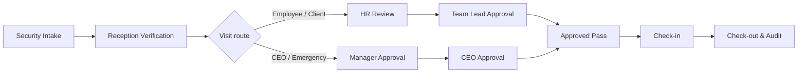

<table>
<tr>
<td width="68%" valign="middle">

### Hi, I'm

# Jety Chodipilli

## Java Backend Developer · Spring Boot · System Design

**Jr. Java Developer @ Brainserve Groups Pvt. Ltd.**

I build backend systems around **security, workflow state, transactions, messaging and recovery** — not just endpoints.

  
  
  
  
  
  

📍 **Hyderabad, India**  
💼 **Current:** Brainserve Groups Pvt. Ltd.  
🔎 **Open to Java Backend / Spring Boot opportunities**

[**BrainServe Live Demo**](https://brain-serve-connect-vercel-demo.vercel.app/) · [**Portfolio**](https://jetychportfolio.netlify.app/) · [**LinkedIn**](https://www.linkedin.com/in/jetychodipilli) · [**ORCID**](https://orcid.org/0009-0008-8585-051X)

</td>
<td width="32%" align="center" valign="middle">

**Backend Engineering**  
**Security · Workflows · Distributed Systems**

</td>
</tr>
</table>

---

## What I work on

| Area | What that means in my projects |
|---|---|
| **Security** | Spring Security, JWT, RBAC, MFA, resource-level authorization |
| **Workflow systems** | approval chains, lifecycle transitions, versioned workflows, audit history |
| **Data consistency** | PostgreSQL, JPA/Hibernate, transactions, Flyway, idempotency |
| **Messaging** | Kafka, transactional outbox, asynchronous notifications, consumer deduplication |
| **Application state** | Redis for OTPs, caching, rate limits and short-lived coordination |
| **Reliability** | retry/recovery paths, health checks, readiness, bounded queries |
| **Testing** | unit, integration, architecture, regression and browser-level verification |

---

# Current Role · Brainserve Groups

### Jr. Java Developer

Most of my current engineering work is centered on **BrainServe Connect**, an enterprise visitor and workforce operations platform.

The system covers visitor intake, employee operations, organizational approvals, QR-based access, notifications, reporting and audit history across multiple roles.

My backend work includes:

- Java 21, Spring Boot, Spring Data JPA and Hibernate
- Spring Security with JWT, role and resource-scope checks
- PostgreSQL transactions and Flyway-managed schema changes
- Redis for OTP state, rate limits and dashboard caching
- Kafka for asynchronous internal-call and notification workflows
- transactional notification/outbox processing
- retry and recovery behavior around database and service failures
- concurrency protection, pagination and bounded queries
- browser multi-tab coordination for live updates
- health/readiness endpoints and operational diagnostics

---

# Flagship · BrainServe Connect

### Enterprise Visitor & Workforce Operations Platform

[**Live Demo →**](https://brain-serve-connect-vercel-demo.vercel.app/) · [**Public Demo →**](https://github.com/JetyChodipilli/Brainserve-Connect-client-demo) · [**Public Implementation Snapshot →**](https://github.com/JetyChodipilli/V2_Brainserve_Connect_gstack)

  

The primary working repository is private. The public demo and implementation snapshot expose the product flow and architecture without publishing the production codebase.

### Production stack

| Layer | Technology |
|---|---|
| **Backend** | Java 21 · Spring Boot 3.5.7 · Spring Modulith |
| **Security** | Spring Security · JWT · role/scope authorization |
| **Data** | PostgreSQL 17.2 · JPA/Hibernate · Flyway |
| **State** | Redis 7.4.1 · OTPs · rate limits · dashboard caching |
| **Messaging** | Apache Kafka 3.9.1 · three-node KRaft cluster |
| **Files** | S3-compatible storage · ClamAV · controlled downloads |
| **Operations** | Actuator · Micrometer · health/readiness endpoints |
| **Delivery** | Maven · Docker · GitHub Actions |

### Engineering details

- authorization and workflow state are enforced in the backend rather than relying on UI controls
- lifecycle transitions are validated before state changes are committed
- asynchronous work is separated from request transactions through durable messaging/outbox patterns
- uploaded files are scanned before controlled download
- database reconnect and recovery behavior is handled as part of the application
- one browser tab owns background live updates while other tabs receive coordinated state
- the verified application snapshot includes **263 passing Node source/regression tests**, with separate browser verification

### Visitor flow

```mermaid
flowchart LR
    A["Security Intake"] --> B["Reception Verification"]
    B --> C{"Visit route"}
    C -->|Employee / Client| D["HR Review"]
    D --> E["Team Lead Approval"]
    C -->|CEO / Emergency| F["Manager Approval"]
    F --> G["CEO Approval"]
    E --> H["Approved Pass"]
    G --> H
    H --> I["Check-in"]
    I --> J["Check-out & Audit"]
```

---

## Selected Engineering Work

### Client Onboarding Platform

**Multi-tenant onboarding · versioned workflows · secure assets · client portal**

[**Repository →**](https://github.com/JetyChodipilli/Client-Onboarding)

A Spring Boot modular monolith for organizations, clients, projects and onboarding workflows.

I kept it as one deployable backend on purpose. The harder problem here is keeping tenancy, workflow definitions, active onboarding runs, permissions and audit history consistent while the product changes.

**Implemented publicly:**

- RBAC, TOTP MFA and security audit records
- clients, projects and lifecycle transitions
- immutable published workflow versions
- dependency graphs with cycle and invalid-edge rejection
- secure invitations and explicit project grants
- questionnaires with review/revision history
- private asset uploads with SHA-256/MIME validation and ClamAV scanning
- Testcontainers, ArchUnit and browser verification

The current main branch CI is green. The published Phase 6 verification records **55 backend tests, 12 frontend unit tests and 89 browser scenarios passing**.

> An onboarding run keeps the workflow version it started with. Editing a template later cannot silently rewrite an active customer's process.

---

### SeatEngine / SeatSure

**Distributed booking · locking · idempotency · event delivery**

[**Repository →**](https://github.com/JetyChodipilli/SeatEngine)

A booking-system project I use to work through concurrency and failure cases:

- Redis, pessimistic JPA and optimistic JPA locking
- database-enforced idempotency
- booking/payment consistency and compensation
- transactional outbox and Kafka delivery
- consumer deduplication and dead-letter topics
- Resilience4j, metrics and distributed tracing

The key problem is simple to state: **if several users request the same seat, only one booking should succeed.**

I keep this as supporting architecture work rather than presenting it as production evidence.

---

### Healthcare Patient Management System

**Microservices learning project**

[**Repository →**](https://github.com/JetyChodipilli/Healthcare-Patient-Management-System-Microservice)

A course-based project I used to practice Spring Boot microservices, Spring Cloud Gateway, Kafka, gRPC, Protocol Buffers, JWT and PostgreSQL.

I label it as learning work intentionally. BrainServe Connect and Client Onboarding are better examples of my own architecture and implementation decisions.

---

## Core stack

| Area | Technologies I use |
|---|---|
| **Java & Spring** | Java 17/21, Spring Boot, Spring MVC, Spring Security, Spring Data JPA, Hibernate, Spring Modulith |
| **Architecture** | REST APIs, modular monoliths, microservices, event-driven workflows |
| **Data** | PostgreSQL, MySQL, Flyway |
| **Messaging & State** | Apache Kafka, Redis |
| **Security** | JWT, RBAC, MFA, BCrypt, resource-level authorization |
| **Testing** | JUnit 5, Mockito, Testcontainers, ArchUnit, integration and browser testing |
| **Delivery** | Maven, Docker, GitHub Actions |
| **Communication** | gRPC, Protocol Buffers |
| **Integration** | AWS SES, S3-compatible storage |

  

---

## More public backend work

| Repository | Focus |
|---|---|
| [Payment Processing Microservice](https://github.com/JetyChodipilli/Payment-Processing-Microservice-with-Stripe-and-MySQL) | payment integration and persistence |
| [AWS SES Email Service](https://github.com/JetyChodipilli/AWS-SES-EmailSend-SpringBoot) | transactional email integration |
| [Employee Management System](https://github.com/JetyChodipilli/EmployeeManagementSystem) | employee records, uploads and reporting |
| [Spring Batch Processing](https://github.com/JetyChodipilli/Spring-Batch-Processing) | batch processing |
| [Spring Boot File Processing API](https://github.com/JetyChodipilli/Spring-Boot-File-Processing-API) | file-processing APIs |

---

## Engineering notes

A few rules I try to keep consistent across projects:

- authorization belongs on the backend
- transaction boundaries should follow business changes, not controller methods
- asynchronous infrastructure should solve a real workload problem
- retries need a recovery model; blind retries are not a strategy
- idempotency matters anywhere a request can safely arrive twice
- schema changes belong in versioned migrations
- tests should cover boundaries and failure paths, not only happy-path methods

---

## Connect

[**LinkedIn**](https://www.linkedin.com/in/jetychodipilli) · [**Portfolio**](https://jetychportfolio.netlify.app/) · [**BrainServe Demo**](https://brain-serve-connect-vercel-demo.vercel.app/) · [**ORCID**](https://orcid.org/0009-0008-8585-051X)

**Java Backend · Spring Boot · Security · System Design**
