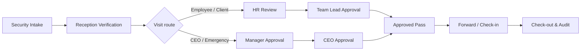

<table>
<tr>
<td width="68%" valign="middle">

### Hi, I'm

# Jety Chodipilli

## Java Backend Developer · Spring Boot · System Design

I build backend applications with **Java, Spring Boot, PostgreSQL, Kafka, Redis and Docker**.

Most of my work involves secure APIs, role-based workflows, database-backed business logic, asynchronous processing and application reliability.

  
  
  
  
  
  

📍 **Hyderabad, India**  
💼 **Open to Java Backend / Spring Boot opportunities**

[**BrainServe Live Demo**](https://brain-serve-connect-vercel-demo.vercel.app/) · [**Portfolio**](https://jetychportfolio.netlify.app/) · [**ORCID**](https://orcid.org/0009-0008-8585-051X)

</td>
<td width="32%" align="center" valign="middle">

**Backend Engineering**  
**Security · Workflows · Distributed Systems**

</td>
</tr>
</table>

---

## What I Work On

| Area | Experience from my projects |
|---|---|
| **Security** | Spring Security, JWT, RBAC, MFA, resource-level authorization |
| **Workflow systems** | approval flows, lifecycle transitions, workflow versioning, audit history |
| **Data** | PostgreSQL, JPA/Hibernate, transactions, Flyway migrations, idempotency |
| **Messaging** | Kafka, asynchronous notifications, durable event processing |
| **Application state** | Redis for OTPs, caching, rate limiting and short-lived state |
| **Testing** | unit, integration, architecture and browser-level testing |
| **Delivery** | Maven, Docker, GitHub Actions and deployable demo environments |

---

# Flagship · BrainServe Connect

### Enterprise Visitor & Workforce Operations Platform

[**Live Demo →**](https://brain-serve-connect-vercel-demo.vercel.app/) · [**Main Repository →**](https://github.com/JetyChodipilli/Brainserve-connect-Appointment-System)

BrainServe Connect is my main backend project.

It uses a **React/TypeScript frontend and Java 21 Spring Boot backend** to handle visitor intake, approvals, employee operations, notifications, reporting and audit history across multiple organizational roles.

### Backend details

- **Java 21 · Spring Boot 3.5.7 · Spring Modulith**
- **PostgreSQL 17.2** for application data
- **3-node Kafka KRaft cluster** for internal-call delivery
- **Redis 7.4.1** for OTP state, rate limits and dashboard caching
- Spring Security with JWT and role/scope checks
- Flyway database migrations
- transactional email/outbox processing
- private file storage with malware scanning and controlled downloads
- health/readiness endpoints and metrics
- verified snapshot: **263 Node source/regression tests passed, 0 failed**, with separate browser verification

### Visitor flow

```mermaid
flowchart LR
    A["Security Intake"] --> B["Reception Verification"]
    B --> C{"Visit route"}
    C -->|Employee / Client| D["HR Review"]
    D --> E["Team Lead Approval"]
    C -->|CEO / Emergency| F["Manager Approval"]
    F --> G["CEO Approval"]
    E --> H["Approved Pass"]
    G --> H
    H --> I["Forward / Check-in"]
    I --> J["Check-out & Audit"]
```

Authorization and workflow state are enforced by the backend rather than relying on UI controls.

---

## Selected Projects

### Client Onboarding Platform
**Multi-tenant onboarding · versioned workflows · client portal**

A Spring Boot modular monolith for managing organizations, clients, projects and onboarding workflows.

Published workflow versions are immutable, so active onboarding runs keep the workflow version they started with even when templates are changed later.

**Stack:** Java 17 · Spring Boot · Spring Security · PostgreSQL · Flyway · MFA · Testcontainers · ArchUnit

[**Repository →**](https://github.com/JetyChodipilli/Client-Onboarding)

---

### SeatEngine
**Distributed booking · locking · idempotency**

A movie-booking backend focused on seat locking, booking consistency and payment flow.

**Stack:** Spring Boot · Redis/JPA locking · JWT gateway security · Kafka outbox events · idempotent booking/payment

[**Repository →**](https://github.com/JetyChodipilli/SeatEngine)

---

### OpsHub
**Workforce operations · modular architecture · event processing**

A modular Spring Boot project for workforce and operational workflows.

**Stack:** PostgreSQL · Kafka outbox/inbox patterns · Redis · resource-scoped authorization

[**Repository →**](https://github.com/JetyChodipilli/OpsHub)

---

### Healthcare Patient Management System
**Microservices learning project**

A course-based project I used to practice service-to-service communication across Patient, Billing, Analytics, Auth and API Gateway services.

**Stack:** Spring Boot · Spring Cloud Gateway · gRPC · Protocol Buffers · Kafka · JWT · PostgreSQL · Docker

[**Repository →**](https://github.com/JetyChodipilli/Healthcare-Patient-Management-System-Microservice)

---

## Backend Practices I Follow

- authorization checks are enforced on the backend
- transaction boundaries are kept around related business changes
- database migrations are versioned with Flyway
- workflow state changes are stored with audit history where required
- Kafka is used for work that benefits from asynchronous processing
- Redis is used for short-lived state, caching and coordination where needed
- retries and recovery paths are handled for network and service failures
- unit tests are supported by integration, architecture and browser-level tests

---

## Core Stack

| Area | Technologies I use |
|---|---|
| **Java & Spring** | Java 17/21, Spring Boot, Spring MVC, Spring Security, Spring Data JPA, Hibernate, Spring Modulith |
| **Architecture** | REST APIs, modular monoliths, microservices, event-driven systems |
| **Data** | PostgreSQL, MySQL, Flyway |
| **Messaging & State** | Apache Kafka, Redis |
| **Security** | JWT, RBAC, MFA, BCrypt, request validation |
| **Testing** | JUnit 5, Mockito, Testcontainers, ArchUnit, integration testing |
| **Delivery** | Maven, Docker, GitHub Actions |
| **Communication** | gRPC, Protocol Buffers |
| **Integration** | AWS SES |

  

---

## More Backend Repositories

| Repository | Focus |
|---|---|
| [Payment Processing Microservice](https://github.com/JetyChodipilli/Payment-Processing-Microservice-with-Stripe-and-MySQL) | payment integration and persistence |
| [AWS SES Email Service](https://github.com/JetyChodipilli/AWS-SES-EmailSend-SpringBoot) | email delivery with AWS SES |
| [Employee Management System](https://github.com/JetyChodipilli/EmployeeManagementSystem) | employee records, uploads and reporting |
| [Spring Batch Processing](https://github.com/JetyChodipilli/Spring-Batch-Processing) | batch processing |
| [Spring Boot File Processing API](https://github.com/JetyChodipilli/Spring-Boot-File-Processing-API) | file-processing APIs |
| [API Gateway Realtime Project](https://github.com/JetyChodipilli/API-Gateway-Realtime-Project) | gateway and distributed application practice |

---

## ORCID

I use ORCID for technical publications, research work and other citable work. GitHub is where I keep my source code.

---

## Contribution Activity

  <picture>
    <source media="(prefers-color-scheme: dark)" srcset="https://raw.githubusercontent.com/JetyChodipilli/JetyChodipilli/output/github-contribution-grid-snake-dark.svg" />
    <source media="(prefers-color-scheme: light)" srcset="https://raw.githubusercontent.com/JetyChodipilli/JetyChodipilli/output/github-contribution-grid-snake.svg" />
    
  </picture>

---

## Connect

[**GitHub**](https://github.com/JetyChodipilli) · [**Portfolio**](https://jetychportfolio.netlify.app/) · [**BrainServe Demo**](https://brain-serve-connect-vercel-demo.vercel.app/) · [**ORCID**](https://orcid.org/0009-0008-8585-051X)

**Java Backend · Spring Boot · Security · System Design**
